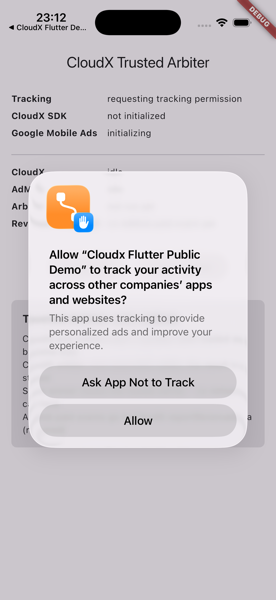
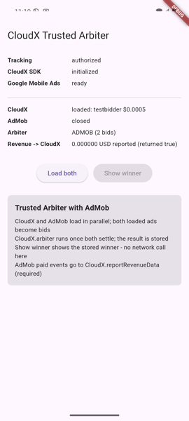

# CloudX Trusted Arbiter Demo - Flutter

A working Trusted Arbiter integration for interstitials. CloudX and AdMob load
in parallel, both fills become bids, and `CloudX.arbiter` decides which one is
shown. Companion to [docs.cloudx.io](https://docs.cloudx.io/en/flutter).

Rewarded ads follow the same flow with one extra callback. Banners are a
different shape entirely: `CloudX.createBanner` places a view at a fixed screen
position and refreshes it on its own, with no arbiter round. Neither is
repeated here; interstitial is the whole demo.

## What Trusted Arbiter is

Your app already buys demand from somewhere else. Trusted Arbiter lets that
demand compete against CloudX on price instead of sitting in a waterfall above
or below it: you load both, hand both to CloudX as bids, and CloudX tells you
which one to show.

Two rules are easy to miss, and both are in the code:

> **The arbiter runs before the show, not during it.** Both sides load, the
> arbiter picks a winner, and the winner is stored. The tap that shows an ad
> makes no network call at all. An integration that arbitrates on the show path
> has already lost the impression to latency.

> **AdMob bids carry no price.** CloudX prices them from realized revenue you
> report back through `CloudX.reportRevenueData` after every AdMob impression.
> That call is part of the integration, not telemetry. Skip it and the AdMob
> side of every auction is priced blind.

Which is why the AdMob ids checked in here make a poor price demo: Google's test
units report a revenue of 0.0, the price store drops any revenue of 0.0, and the
AdMob bid therefore reaches the arbiter with no price at all. Expect CloudX to
lose those rounds. Point the demo at a real AdMob unit that pays to see prices
compete.

## What is in here

Copy [`lib/cloudx/`](lib/cloudx). Those six files are the whole integration,
and none of them builds a widget. Everything outside that folder is this demo's
own scaffolding.

| File | What it is |
|---|---|
| [`lib/cloudx/arbiter_interstitial_controller.dart`](lib/cloudx/arbiter_interstitial_controller.dart) | The integration. The whole load/arbitrate/show cycle and both SDKs' calls, in one file. |
| [`lib/cloudx/arbiter_events.dart`](lib/cloudx/arbiter_events.dart) | The callbacks the controller reports through. |
| [`lib/cloudx/sdk_startup.dart`](lib/cloudx/sdk_startup.dart) | Brings both SDKs up, in the order they have to come up in. |
| [`lib/cloudx/tracking_gate.dart`](lib/cloudx/tracking_gate.dart) | The iOS App Tracking Transparency gate. |
| [`lib/cloudx/cloudx_failure_text.dart`](lib/cloudx/cloudx_failure_text.dart) | One line out of a CloudX failure, carrying the SDK's own name for the error code. |
| [`lib/cloudx/demo_config.dart`](lib/cloudx/demo_config.dart) | App key and ad unit ids, per platform. The first file to edit. |
| [`lib/ui/arbiter_screen.dart`](lib/ui/arbiter_screen.dart) | Demo-only UI. Ignore it when reading the integration. |
| [`lib/main.dart`](lib/main.dart) | `runApp`, nothing else. |

**Take fewer and it will not build.** The controller reports through
`arbiter_events.dart`, both it and `sdk_startup.dart` format failures through
`cloudx_failure_text.dart`, and `sdk_startup.dart` calls `tracking_gate.dart`.
If your app already initializes CloudX and answers the ATT prompt, drop
`sdk_startup.dart` and `tracking_gate.dart` and keep the rest.

Read them in this order:

1. [`demo_config.dart`](lib/cloudx/demo_config.dart) - the ids, and what has to
   match what
2. [`sdk_startup.dart`](lib/cloudx/sdk_startup.dart) - why ATT comes before
   `CloudX.initialize`
3. [`arbiter_interstitial_controller.dart`](lib/cloudx/arbiter_interstitial_controller.dart)
   - the cycle itself

**No CloudX or AdMob call lives outside `lib/cloudx/`.** That is checkable:
`grep -rn "CloudX\.\|MobileAds\." lib/ui lib/main.dart` returns only two
strings printed on screen. The integration files import
`package:flutter/foundation.dart` for logging, and `tracking_gate.dart` also
needs `package:flutter/widgets.dart` to wait for the app to become active before
prompting, but none of them imports `material.dart` or builds a widget.

## The cycle

```
  load()
    |
    +--> CloudX  loadInterstitial ---+
    |                                |  both settled (loaded or failed)
    +--> AdMob   InterstitialAd.load +--> CloudX.arbiter(bids) --> winner stored
                                                                        |
  show()  -----------------------------------------------------------> shows it
    |                                                            (no network call)
    +-- no winner stored? returns false; carry on with your app
                                                                        |
  ad closes --> that side's fill is consumed --> load() reloads only what is missing
```

Details worth knowing:

- **A `none` result is not a winner.** It is stored as "nothing", so the next
  `load()` runs the round again instead of parking on a winner that cannot show.
- **`load()` starts only what is missing.** After one side fails, a retry
  reloads that side alone and re-arbitrates when it settles.
- **The CloudX interstitial listener is global per ad format.** The controller
  re-claims it before every load *and* before every show, because anything else
  in your app that loads an interstitial takes it over, and its callbacks would
  go there instead.
- **The ad is destroyed from `onAdHidden`.** At that point the SDK still counts
  it as showing, and a load on it is rejected with
  `LOAD_NOT_ALLOWED_WHILE_SHOWING`. Destroying leaves the next load to build a
  fresh instance, which is also what makes it run a new auction.

## Required setup

1. **Enable Trusted Arbiter for your app in the CloudX dashboard.** No code here
   can turn it on. You can confirm it from the logs at startup:
   `[InitializationService] Arbiter enabled: https://sdk.cloudx.io/arbitration`.
2. **Match your app key to your bundle id.** Bid requests are authorized per app
   key AND bundle id. Change `lib/cloudx/demo_config.dart`, the Android
   `applicationId` and the iOS `PRODUCT_BUNDLE_IDENTIFIER` together, or every
   round comes back `NO_FILL[302]` with nothing to say the pairing is why.
3. **Set the Google Mobile Ads application id natively**, in
   `android/app/src/main/AndroidManifest.xml` and `ios/Runner/Info.plist`. The
   Google SDK throws at startup when it is absent.
4. **Answer the ATT prompt on iOS.** CloudX reads the tracking status but never
   asks for it, and treats "not determined" the same as denied. This app asks
   before initializing and refuses to continue when the answer is no.

   

   The prompt is answered while `CloudX SDK` still reads `not initialized`. That
   order is the point: initialize first and every request that session goes out
   without an IDFA and with `dnt = 1`.
5. **Set your Signing Team in Xcode** before an iOS device or archive build. The
   project ships with no `DEVELOPMENT_TEAM` on purpose, so signing stays on
   automatic and resolves to your own team.

> The ad unit ids checked in here belong to the public CloudX sample app
> (`io.cloudx.sample`), and the AdMob ids are Google's public test units.
> Replace all of them.

## Versions

| Pin | Version | Why |
|---|---|---|
| `cloudx_flutter` | 3.9.0 | The plugin. Brings the native SDKs with it. |
| `io.cloudx:sdk` | 4.7.0 | Android native SDK. Declared explicitly so the version is visible in one place. |
| `CloudXCore` | 3.9.0 | iOS native SDK. |
| `google_mobile_ads` | 9.1.0 exactly | AdMob is the second bidder. Exact, so a clone reproduces the same native graph. |
| `app_tracking_transparency` | ^2.0.4 | The ATT prompt. |

Dart 3.12 and Flutter 3.44 are the floors, set by `webview_flutter_android` and
`webview_flutter_wkwebview`, which `google_mobile_ads` 9.1.0 pulls in.

**`CloudXGoogleWaterfallAdapter` / `io.cloudx:adapter-googlewaterfall` is
deliberately absent.** It runs AdMob demand *inside* the CloudX auction, which
is the opposite of what this demo shows: here AdMob is an external bid competing
against CloudX through the arbiter. Shipping both would make the two bids the
same demand.

The adapter list in `android/app/build.gradle.kts` and `ios/Podfile` is the full
CloudX set. Take only the networks your dashboard actually serves; each one adds
to your binary.

**BIGO is Android only**, which is why the Gradle file lists one network more
than the Podfile. It also needs cleartext traffic to `127.0.0.1`, because the
BIGO Ads SDK serves some creative assets from a loopback server on the device:
that is what `android/app/src/main/res/xml/network_security_config.xml` is for,
and the `<application>` element references it. Drop the adapter and you can drop
both. See the
[BIGO adapter page](https://docs.cloudx.io/en/android/adapters/bigo/overview).

## Running

```sh
flutter pub get
(cd ios && pod install)   # iOS only
flutter run
```

## Reading the screen

Every status line names the platform it came from, so the screen doubles as the
diagnostic.




| Line | Meaning |
|---|---|
| `CloudX` / `AdMob` | That side's last event: `loading`, `loaded: <network> $<price>`, `load failed: ...`, `showing`, `closed`. A CloudX failure carries the SDK's own name for the code, so a round that did not fill reads `load failed: No ad available. (NO_FILL[302])` rather than a bare number. |
| `Arbiter` | `ADMOB (2 bids)`, `CLOUDX (2 bids)`, `no winner (1 bid)`, or `failed: ...`. |
| `Revenue -> CloudX` | The last AdMob paid event forwarded through `reportRevenueData`, and what that call returned. A `true` does not mean the price was kept; a revenue of 0.0 is discarded. |

If `Arbiter` only ever reads `(1 bid)`, one side is not filling. Look at which
of the two lines above it says `load failed`; the arbiter is working correctly
either way.
