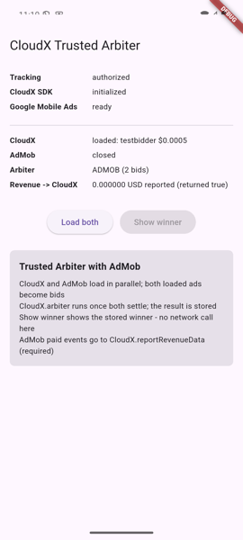
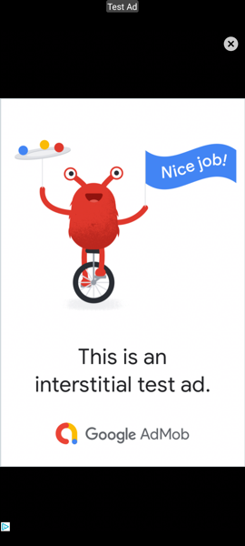
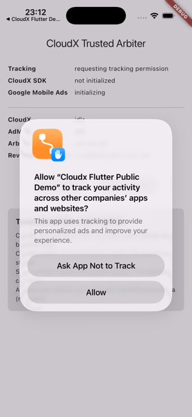

# CloudX Trusted Arbiter Demo - Flutter

A complete, runnable Flutter app showing how to put CloudX in competition with
another ad network on price. CloudX and AdMob load an interstitial in parallel,
both fills become bids, and `CloudX.arbiter` decides which one gets shown.

Clone it and run it. It works out of the box against CloudX's public sample app,
so you can watch a real auction before you change a single id.




Interstitials only. Rewarded ads follow the same flow with one extra callback,
and banners are a different shape entirely (`CloudX.createBanner` places a view
at a fixed position and refreshes it on its own, with no arbiter round), so
neither is repeated here.

Full documentation: [Flutter integration
guide](https://docs.cloudx.io/en/flutter/integration) and [Trusted
Arbiter](https://docs.cloudx.io/en/flutter/trusted-arbiter).

## Run it

You need Flutter 3.44 or newer (Dart 3.12), and Xcode if you want the iOS side.
Nothing else: the ids checked in belong to CloudX's public sample app, so the
demo runs as-is.

```sh
flutter pub get
(cd ios && pod install --repo-update)   # iOS only
flutter run
```

Tap **Load both**, wait for both sides to settle, then tap **Show winner**. On
iOS you will be asked for tracking permission first; see the ATT note under
[Point it at your own app](#point-it-at-your-own-app) for why that has to come
before anything else.

**Debugger** opens the CloudX Mediation Debugger. It reports the SDK and plugin
versions and lists every adapter that is actually linked, with the version each
one resolved to, which makes it the quickest way to see what the ranges in
[Versions and adapters](#versions-and-adapters) resolved to on this build. It
needs the SDK initialized, so it stays disabled until `CloudX SDK` reads
`initialized`.

Every network in that list will read **Not in server config** here. That is
expected: the sample dashboard app these ids belong to serves a test bidder
only, so the adapters are linked but none of them is provisioned. Point the demo
at [your own app](#point-it-at-your-own-app) and the networks you have
configured start reporting their real state.

If you want the iOS build on a device or an archive, set your own Signing Team
in Xcode. The project deliberately ships with no `DEVELOPMENT_TEAM`, so signing
stays on automatic and resolves to your team rather than ours.

## What Trusted Arbiter is

Your app already buys demand from somewhere else. Trusted Arbiter lets that
demand compete against CloudX on price instead of sitting in a waterfall above
or below it: you load both, hand both to CloudX as bids, and CloudX tells you
which one to show.

Two rules are easy to miss, and both are visible in the code:

> **The arbiter runs before the show, not during it.** Both sides load, the
> arbiter picks a winner, and the winner is stored. The tap that shows an ad
> makes no network call at all. An integration that arbitrates on the show path
> has already lost the impression to latency.

> **AdMob bids carry no price.** CloudX prices them from realized revenue you
> report back through `CloudX.reportRevenueData` after every AdMob impression.
> That call is part of the integration, not telemetry. Skip it and the AdMob
> side of every auction is priced blind.

Which is why the AdMob ids checked in here make a poor price demo: Google's test
units report a revenue of 0.0, the price store drops any revenue of 0.0, and the
AdMob bid therefore reaches the arbiter with no price at all. Expect CloudX to
lose those rounds. Point the demo at a real AdMob unit that pays to see prices
compete.

## What to copy into your app

Copy [`lib/cloudx/`](lib/cloudx). Those six files are the whole integration, and
none of them builds a widget, so they drop into an app with any UI. Everything
outside that folder is this demo's own scaffolding.

| File | What it is |
|---|---|
| [`lib/cloudx/arbiter_interstitial_controller.dart`](lib/cloudx/arbiter_interstitial_controller.dart) | The integration. The whole load/arbitrate/show cycle and both SDKs' calls, in one file. |
| [`lib/cloudx/arbiter_events.dart`](lib/cloudx/arbiter_events.dart) | The callbacks the controller reports through. |
| [`lib/cloudx/sdk_startup.dart`](lib/cloudx/sdk_startup.dart) | Brings both SDKs up, in the order they have to come up in. |
| [`lib/cloudx/tracking_gate.dart`](lib/cloudx/tracking_gate.dart) | The iOS App Tracking Transparency gate. |
| [`lib/cloudx/cloudx_failure_text.dart`](lib/cloudx/cloudx_failure_text.dart) | One line out of a CloudX failure, carrying the SDK's own name for the error code. |
| [`lib/cloudx/demo_config.dart`](lib/cloudx/demo_config.dart) | App key and ad unit ids, per platform. The first file to edit. |

`lib/ui/` and `lib/main.dart` are the demo's screen and entry point. They are
here so the app runs; they are not part of the integration.

**Take fewer files and it will not build.** The controller reports through
`arbiter_events.dart`, both it and `sdk_startup.dart` format failures through
`cloudx_failure_text.dart`, and `sdk_startup.dart` calls `tracking_gate.dart`.
If your app already initializes CloudX and answers the ATT prompt, drop
`sdk_startup.dart` and `tracking_gate.dart` and keep the rest.

Read them in this order:

1. [`demo_config.dart`](lib/cloudx/demo_config.dart) - the ids, and what has to
   match what
2. [`sdk_startup.dart`](lib/cloudx/sdk_startup.dart) - why ATT comes before
   `CloudX.initialize`
3. [`arbiter_interstitial_controller.dart`](lib/cloudx/arbiter_interstitial_controller.dart)
   - the cycle itself

## How the cycle works

```
  load()
    |
    +--> CloudX  loadInterstitial ---+
    |                                |  both settled (loaded or failed)
    +--> AdMob   InterstitialAd.load +--> CloudX.arbiter(bids) --> winner stored
                                                                        |
  show()  -----------------------------------------------------------> shows it
    |                                                            (no network call)
    +-- no winner stored? returns false; carry on with your app
                                                                        |
  ad closes --> that side's fill is consumed --> load() reloads only what is missing
```

Four things in that cycle are easy to get wrong. The code handles all four, and
they are worth understanding before you adapt it:

- **A `none` result is not a winner.** It is stored as "nothing", so the next
  `load()` runs the round again instead of parking on a winner that cannot show.
- **`load()` starts only what is missing.** After one side fails, a retry
  reloads that side alone and re-arbitrates when it settles.
- **The CloudX interstitial listener is global per ad format.** The controller
  re-claims it before every load *and* before every show, because anything else
  in your app that loads an interstitial takes it over, and its callbacks would
  go there instead.
- **The ad is destroyed from `onAdHidden`.** At that point the SDK still counts
  it as showing, and a load on it is rejected with
  `LOAD_NOT_ALLOWED_WHILE_SHOWING`. Destroying leaves the next load to build a
  fresh instance, which is also what makes it run a new auction.

## Point it at your own app

The ad unit ids checked in here belong to CloudX's public sample app
(`io.cloudx.sample`), and the AdMob ids are Google's public test units. Replace
all of them, and do these five things together:

1. **Ask CloudX to enable Trusted Arbiter for your app.** No code here can turn
   it on. Confirm it from the logs at startup:
   `[InitializationService] Arbiter enabled: https://sdk.cloudx.io/arbitration`.
   If that line is missing, the arbiter call will not do what this demo shows.
2. **Match your app key to your bundle id.** Bid requests are authorized per app
   key AND bundle id. Change `lib/cloudx/demo_config.dart`, the Android
   `applicationId` and the iOS `PRODUCT_BUNDLE_IDENTIFIER` together. Get this
   wrong and every round comes back `NO_FILL[302]`, with nothing on screen to
   say the pairing is the reason.
3. **Set the Google Mobile Ads application id natively**, in
   `android/app/src/main/AndroidManifest.xml` and `ios/Runner/Info.plist`. The
   Google SDK throws at startup when it is absent.
4. **Answer the ATT prompt on iOS.** CloudX reads the tracking status but never
   asks for it, and treats "not determined" the same as denied. This app asks
   before initializing and refuses to continue when the answer is no.

   

   The prompt is answered while `CloudX SDK` still reads `not initialized`. That
   order is the point: initialize first and every request that session goes out
   without an IDFA and with `dnt = 1`.
5. **Set your Signing Team in Xcode** before an iOS device or archive build, as
   above.

## Reading the screen

Every status line names the platform it came from, so the screen doubles as the
diagnostic.

| Line | Meaning |
|---|---|
| `CloudX` / `AdMob` | That side's last event: `loading`, `loaded: <network> $<price>`, `load failed: ...`, `showing`, `closed`. A CloudX failure carries the SDK's own name for the code, so a round that did not fill reads `load failed: No ad available. (NO_FILL[302])` rather than a bare number. |
| `Arbiter` | `ADMOB (2 bids)`, `CLOUDX (2 bids)`, `no winner (1 bid)`, or `failed: ...`. |
| `Revenue -> CloudX` | The last AdMob paid event forwarded through `reportRevenueData`, and what that call returned. A `true` does not mean the price was kept; a revenue of 0.0 is discarded. |

If `Arbiter` only ever reads `(1 bid)`, one side is not filling. Look at which
of the two lines above it says `load failed`; the arbiter is working correctly
either way.

## Versions and adapters

Every CloudX dependency is declared by major version and resolves to the newest
release on that line, so this demo does not go stale between CloudX releases.

| Pin | Declared as | Example |
|---|---|---|
| `cloudx_flutter` | pub caret range | `^3.10.0` (`>= 3.10.0, < 4.0.0`) |
| Android SDK and adapters | Gradle `+` | `io.cloudx:adapter-vungle:7.+` |
| iOS adapters | CocoaPods `~>` | `pod 'CloudXVungleAdapter', '~> 7.0'` (`>= 7.0, < 8.0`) |

Two components are what makes the CocoaPods form a major-version range. A
four-component `~> 7.7.6.0` means `>= 7.7.6.0, < 7.7.7.0`, a patch lock that
only looks like one.

`CloudXCore` is not declared anywhere in this repo. The `cloudx_flutter`
podspec pins it, so the iOS core follows the plugin. On Android
`io.cloudx:sdk:4.+` is declared in `android/app/build.gradle.kts` so the core is
visible in one place.

**No lockfile is committed.** `pubspec.lock` and `ios/Podfile.lock` are both
gitignored, because a committed lock replays the versions it recorded and would
undo every range above on a fresh clone. The trade-off is real and worth
knowing: the versions this demo resolves can change without a commit here. That
is the point, and it is also the risk.

The two dependencies that are not CloudX keep their original constraints:

| Pin | Version | Why |
|---|---|---|
| `google_mobile_ads` | 9.1.0 exactly | AdMob is the second bidder, not the subject. Exact, so a clone reproduces the same native graph. |
| `app_tracking_transparency` | ^2.0.4 | The ATT prompt. |

Dart 3.12 and Flutter 3.44 are the floors, set by `webview_flutter_android` and
`webview_flutter_wkwebview`, which `google_mobile_ads` 9.1.0 pulls in.

Two toolchain floors come from the adapters rather than from Flutter:

- **Xcode 26.1** on iOS. `~> 4.0` resolves Unity Ads 4.20.1.0, which fails to
  link on Xcode 16.x with `Undefined symbol: _swift_coroFrameAlloc`, and
  `~> 8.0` resolves Digital Turbine 8.4.10.0, which states the same floor.
- **Android API 36** to compile. `io.cloudx:adapter-meta` needs it, because Meta
  Audience Network 6.22.0 depends on `androidx.browser` 1.9.0. That is what
  `compileSdk = maxOf(flutter.compileSdkVersion, 36)` is for; `targetSdk` does
  not change.

The adapter list in `android/app/build.gradle.kts` and `ios/Podfile` is the full
CloudX set, so you can see the shape of it. **Take only the networks your
dashboard actually serves**; each one adds to your binary.

**`CloudXGoogleWaterfallAdapter` / `io.cloudx:adapter-googlewaterfall` is
deliberately absent.** It runs AdMob demand *inside* the CloudX auction, which
is the opposite of what this demo shows: here AdMob is an external bid competing
against CloudX through the arbiter. Shipping both would make the two bids the
same demand.

**BIGO is in the Gradle file but not in the Podfile**, which is why the Gradle
file lists one network more. An iOS adapter does exist, but with
`CloudXBigoAdapter` installed the Flutter tool drops arm64 from Simulator
builds, and the resulting x86_64-only Runner will not install on an Apple
Silicon simulator. This demo has to run as-is on `flutter run`, so the pod stays
out; test BIGO on a physical iOS device.

On Android it also needs cleartext traffic to `127.0.0.1`, because the BIGO Ads
SDK serves some creative assets from a loopback server on the device: that is
what `android/app/src/main/res/xml/network_security_config.xml` is for, and the
`<application>` element references it. Drop the adapter and you can drop both.
See the [BIGO adapter
page](https://docs.cloudx.io/en/android/adapters/bigo/overview).

## Getting help

Start with the [Flutter integration
guide](https://docs.cloudx.io/en/flutter/integration), the [Trusted Arbiter
page](https://docs.cloudx.io/en/flutter/trusted-arbiter), and the
[changelog](https://docs.cloudx.io/en/flutter/changelog). The plugin itself is
on pub.dev as [`cloudx_flutter`](https://pub.dev/packages/cloudx_flutter).

For an app key, ad unit ids, or to have Trusted Arbiter switched on, talk to
your CloudX contact.
